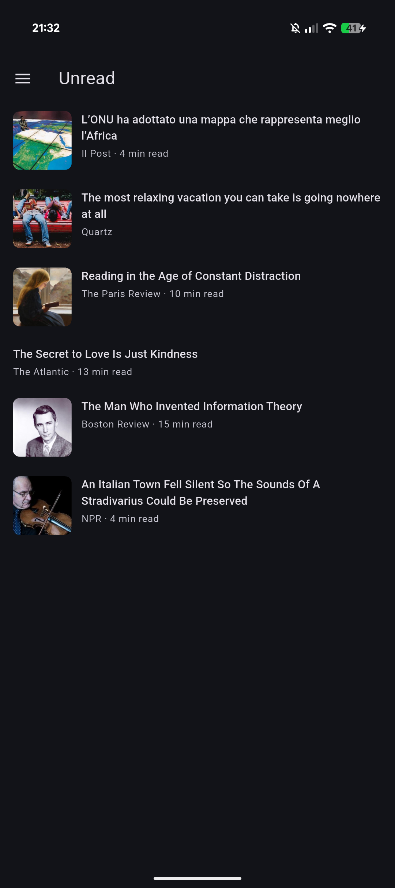

# Readeck Flutter

This is an Android client application for [Readeck] written with [Flutter].  
It's clean, simple and just does one thing:
helping you catch up with articles you had saved to read later.



## Development setup

Install dependencies:
```bash
flutter pub get
```

Run tests:
```bash
flutter test
```

If you need to confirm the available devices first:
```bash
flutter devices
```

Build and run on Android:
```bash
# Start an emulator or connect an Android device, then run:
flutter run -d android # or the id of your device

# Or: build the APK and then run
flutter build apk --debug
adb install -r build/app/outputs/flutter-apk/app-debug.apk
```

Run a local version of Readeck:
```bash
docker run --rm -p 8000:8000 -v readeck-data:/readeck codeberg.org/readeck/readeck:latest
```

 [flutter]: https://flutter.dev/
 [readeck]: https://readeck.org